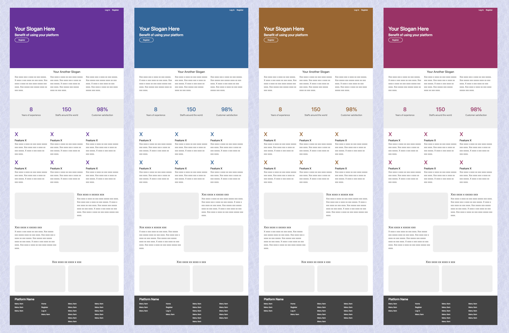

# Platform

Spring Boot MVC seems to be a very hard stack for
many reasons. In this sample project, we use
Spring Boot with JPA and Bootstrap to create a
platform for user registration, log in, and log out.

